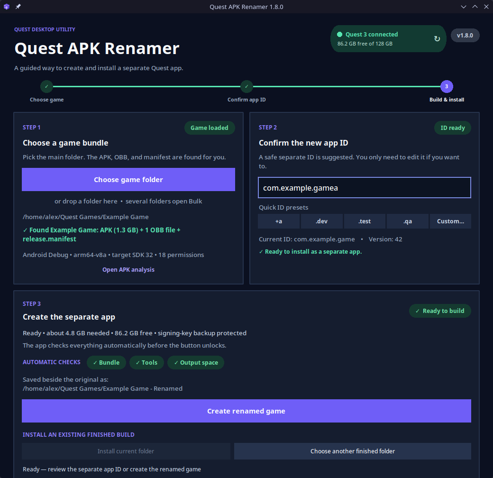
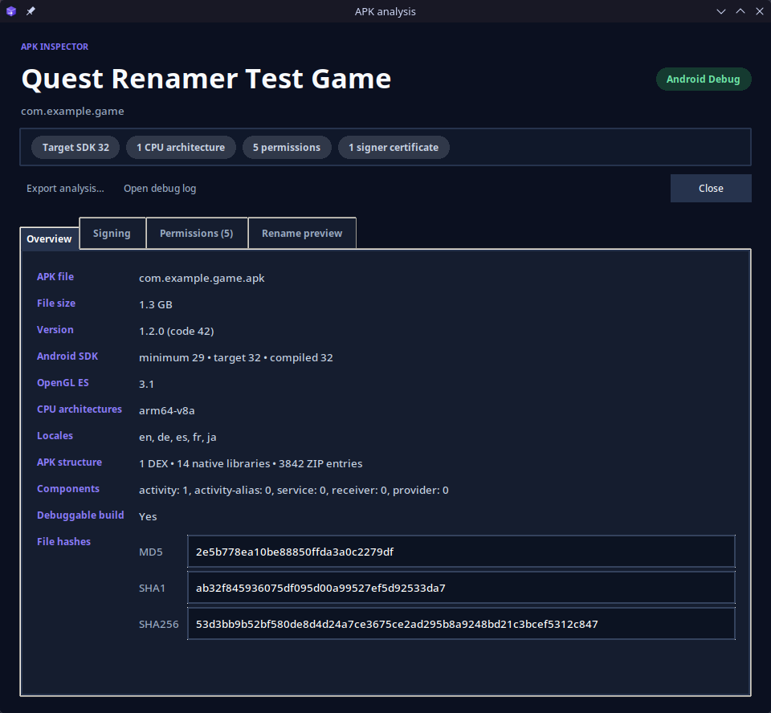
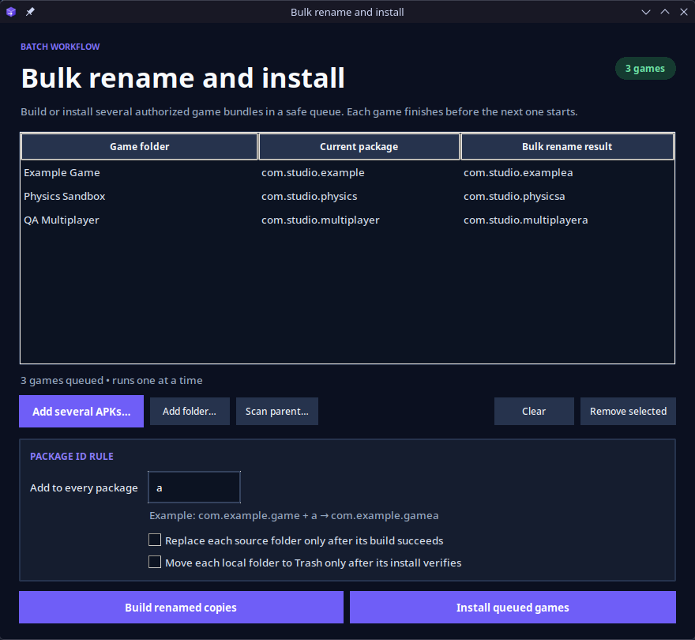
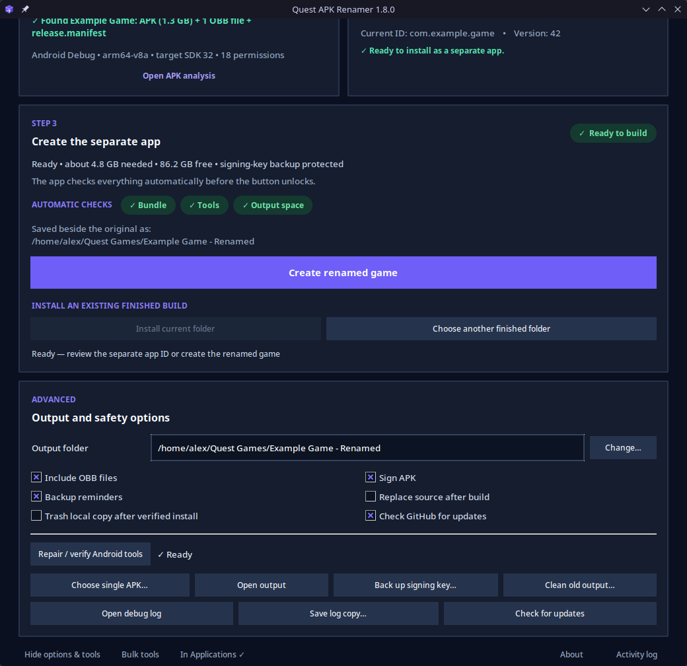

<p align="center">
  
</p>

<h1 align="center">Quest APK Renamer</h1>

<p align="center">
  Create a separately installable copy of a Quest app by changing its Android
  package ID and keeping its APK, OBB, and manifest together.
</p>

<p align="center">
  <a href="#download">Download</a> ·
  <a href="#quick-start">Quick start</a> ·
  <a href="#guided-interface">Guided interface</a> ·
  <a href="#apk-analysis-and-debug-reports">APK analysis</a> ·
  <a href="#bulk-tools">Bulk tools</a> ·
  <a href="#troubleshooting">Troubleshooting</a>
</p>

<p align="center">
  
  
  
</p>

> [!IMPORTANT]
> Use this app only with software you own or are authorized to modify. Changing
> a package ID does not bypass ownership, licensing, online entitlement, or
> anti-tamper checks.

> [!WARNING]
> This app was made 100% by AI, so expect some bugs and use caution. Keep your
> original game folders and signing-key backups.



## Highlights

| Feature | What it gives you |
| --- | --- |
| Guided three-step workflow | Live progress rail, clear next action, and controls that unlock only when useful |
| Automatic safety checks | Bundle, Android tools, package rules, signing, local space, and Quest space checked for you |
| APK inspector | SDKs, ABIs, permissions, components, hashes, signatures, certificates, and rename preview |
| Complete audit reports | Human-readable and JSON records of every technical change and signing identity |
| Quest installer | APK and OBB transfer, storage warning, install verification, and failed-OBB-only retry |
| Bulk queue | Add several APKs, preview IDs, then build or install them sequentially |

## What it does

Choose a game folder and the app handles the technical work:

- detects the APK, OBB files, `release.manifest`, package ID, and version;
- shows the current step and guides you to the next useful action;
- analyzes SDK levels, CPU architectures, permissions, features, hashes, and
  signing certificates in the background;
- suggests a new package ID with one-click `+a`, `.dev`, `.test`, `.qa`, and
  custom presets without changing the game name or in-game text;
- checks the bundle, Android tools, package rules, and free space automatically;
- rebuilds, signs, and verifies the APK with a persistent local key;
- renames OBB files and updates `release.manifest`;
- writes text and JSON change reports into every finished folder;
- installs the APK and OBB together over USB;
- verifies the installed package and transferred OBB sizes; and
- keeps the original folder unchanged unless you explicitly enable replacement.

The app also supports real progress, safe cancellation, failed-OBB retry,
Quest connection and free-space status, bulk queues, recoverable cleanup, and
signing-key backup reminders.

## Download

Open the [current 1.9.0 beta release](../../releases/tag/v1.9.0-beta.1), then
choose the file for your computer:

| Platform | Download | Notes |
| --- | --- | --- |
| Windows | `Quest-APK-Renamer-1.9.0-Setup.exe` | Per-user installer; no administrator access required |
| Apple Silicon Mac | `Quest-APK-Renamer-1.9.0-macOS-arm64.dmg` | For M1, M2, M3, M4, and newer |
| Intel Mac | `Quest-APK-Renamer-1.9.0-macOS-x86_64.dmg` | For Intel-based Macs |
| Linux x86_64 | `Quest-APK-Renamer-1.9.0-Linux-x86_64.tar.gz` | Extract, then run `./install.sh` |

Each package includes the required Android tools and a trimmed Java runtime.
You do not need to install Java, ADB, Apktool, or an APK signer separately.

Early Windows builds are not code-signed, and current macOS builds are not
notarized. Your operating system may show an unknown-developer warning. Compare
the download with its matching `SHA256SUMS` file before opening it.

## Quick start

1. Connect your Quest by USB.
2. Approve the USB-debugging prompt inside the headset and keep it awake.
3. Choose or drop the main game folder.
4. Keep the suggested new app ID, or edit it.
5. Wait for **Ready to build**, then select **Create renamed game**.
6. When it finishes, select **Install finished game**.

That is the normal workflow. Preflight checks and Quest storage checks happen
automatically.

Changing the package ID makes Android treat the result as a separate app. It
uses a separate save-data location and does not replace the original package.

## Guided interface

The main window is designed to explain itself while you work:

- the progress rail shows **Choose game → Confirm app ID → Build & install**;
- live badges show when the bundle and separate ID are ready;
- automatic-check pills confirm the bundle, tools, and output space;
- the Quest card shows USB state and available headset storage;
- invalid or unchanged package IDs get a plain-language correction;
- advanced controls stay out of the normal three-step path; and
- narrow windows stack the cards while mouse-wheel and trackpad scrolling
  remain available without a permanent scrollbar.

The build button stays locked until the current bundle, package ID, tools, and
storage checks all pass.

## Game-folder layout

A typical input folder looks like this:

```text
My Game/
├── com.example.game.apk
├── release.manifest
└── com.example.game/
    └── main.11868.com.example.game.obb
```

The default output is created beside it:

```text
My Game - Renamed/
├── com.example.gamea.apk
├── release.manifest
├── RENAMED-BUNDLE.txt
├── RENAME-REPORT.txt
├── RENAME-REPORT.json
└── com.example.gamea/
    └── main.11868.com.example.gamea.obb
```

The original folder stays untouched.

## APK analysis and debug reports

After selecting a game, choose **Open APK analysis** to inspect:

- package, label, version, minimum/target/compile SDK, and OpenGL ES;
- CPU architectures, locales, DEX count, native libraries, and components;
- requested permissions and hardware features;
- MD5, SHA-1, and SHA-256 file hashes;
- verified V1/V2/V3 signature schemes;
- certificate subject, issuer, fingerprints, and recognized signer; and
- every technical package reference planned for replacement.

The scan fully decodes technical DEX/smali references in the background. It
also lists package IDs found in assets, native libraries, or other compiled
data that the app will preserve to avoid corrupting game content.



Recognized first-party and development identities currently include Quest APK
Renamer, Meta/Oculus, Google, and Android Debug. The registry is stored in
[`resources/known-signers.json`](resources/known-signers.json) so developers
can review or extend it.

Every completed build contains:

- `RENAME-REPORT.txt` for a short human-readable summary; and
- `RENAME-REPORT.json` for file-by-file changes, APK metadata, permissions,
  hashes, source/output certificates, OBB mappings, and signing provenance.

The signing-provenance section records the original and output certificate
fingerprints. It is audit metadata—not Android cryptographic key rotation.
Recreating the original signer is impossible without its private key, so the
renamed APK continues using your persistent Quest APK Renamer key.

## Bulk tools

Select **Bulk tools** or drop several game folders onto the main window. You
can:

- choose several APKs in one picker;
- add folders individually or scan a parent folder;
- preview the old and new package IDs;
- add the same suffix, such as `a`, to every selected package;
- choose **Build renamed copies** or **Install queued games**;
- process each game sequentially without stopping the remaining queue after one
  failure; and
- review a success/failure summary when the queue finishes.



A failed bulk job does not stop the remaining games. Source replacement and
post-install local cleanup remain separate opt-in choices.

## Options

The main screen intentionally shows only the common workflow. Select
**Options & tools** for:

- a custom output folder;
- APK-only selection for unusual layouts;
- OBB and signing switches;
- signing-key backup reminders;
- automatic GitHub update checks;
- staged source-folder replacement;
- cleanup only after a fully verified Quest install;
- Android-tool repair;
- manual signing-key backup;
- opening or exporting the persistent rotating debug log;
- a manual GitHub update check; and
- cleanup of old app-created output.

Select **Activity log** to see the current operation without leaving the main
window.



## Installation safety

Quest installation runs in this order:

1. Find exactly one authorized Quest.
2. Check available headset storage.
3. Warn if the new package already exists.
4. Install or update the APK.
5. Copy every OBB into `/sdcard/Android/obb/<new.package>/`.
6. Verify each OBB size and confirm that Android reports the package.

If an OBB transfer fails, select **Retry only the failed OBB files**. The APK
is not reinstalled and successful OBB files are not resent.

Cancellation waits for a safe stage boundary. When partial files exist, the app
asks whether you want them removed.

## Signing-key backup

The first signed build creates a persistent signing identity:

| Platform | Location |
| --- | --- |
| Windows | `%LOCALAPPDATA%\Quest APK Renamer\` |
| macOS | `~/Library/Application Support/Quest APK Renamer/` |
| Linux | `~/.local/share/quest-apk-renamer/` |

Back up these two files together and keep them private:

```text
quest-renamer-signing-key.jks
signing-key.json
```

Android requires the same key for later updates to an installed renamed app.
Losing it means that app must be uninstalled before using a different key.

## Troubleshooting

### Quest is not connected

- Enable Developer Mode and USB debugging.
- Approve the computer inside the headset.
- Use a data-capable USB cable.
- Keep the headset awake.
- Close other apps that may be controlling ADB, then click the Quest status
  card to refresh it.

### The game does not launch after renaming

Some games store their original package ID in native code, encrypted data,
server configuration, or anti-tamper logic. Those private references cannot
always be rewritten safely. Open **Activity log** to see the last completed
stage, then use **Options & tools → Open debug log** for the persistent record.

### The APK installs but game data is missing

Confirm that the renamed OBB is located under:

```text
/sdcard/Android/obb/<new.package>/
```

The APK package ID, OBB folder, and package portion of the OBB filename must
match exactly.

### Android reports a signature conflict

Restore the signing-key backup previously used for that renamed package, or
uninstall the renamed package before installing a build signed with another
key.

### Something else went wrong

[Open an issue](https://github.com/RockoTheeHut/Quest-APK-Renamer/issues/new/choose)
and include your platform, app version, what you selected, and the text shown
under **Activity log**. Do not upload copyrighted APKs, OBBs, or signing keys.
The persistent log can contain local file paths, so review it before sharing.

The rotating log is named `Quest-APK-Renamer.log` and is kept beside the
signing-key settings in the platform-specific app-data folder. Use
**Options & tools → Open debug log** or **Save log copy**.

## Platform status

- **Linux:** the primary development and hands-on testing platform.
- **Windows:** partially tested by hand; automated tests and packaging pass.
- **macOS:** experimental and not fully tested by hand. An Apple Silicon startup
  failure has been reported and is being investigated.

Please file an issue for any platform problem. I will investigate it as soon as
I can.

## Build from source

Run the tests:

```bash
python3 -m unittest discover -s tests -v
```

Build a release package:

```powershell
# Windows
powershell -ExecutionPolicy Bypass -File .\windows\build.ps1 -BuildInstaller
```

```bash
# macOS
./macos/build.sh

# Linux x86_64
./linux/build.sh
```

More detail is available in
[windows/README.md](windows/README.md),
[macos/README.md](macos/README.md),
[linux/README.md](linux/README.md), and
[docs/RELEASING.md](docs/RELEASING.md).

## Privacy and safety

- Everything runs locally; game files are never uploaded.
- Source folders are read-only by default.
- Source replacement is staged and rollback-protected.
- Cleanup only accepts folders carrying the app's managed-output marker.
- Signing passwords are masked from the operation log.
- Update checks contact only GitHub's public release/tag API and can be disabled
  under **Options & tools**.
- Tool downloads are pinned and SHA-256 verified where possible.

See [SECURITY.md](SECURITY.md) for private vulnerability reports and
[CONTRIBUTING.md](CONTRIBUTING.md) for contribution guidance.

## Third-party components

Release packages use Apktool, Uber APK Signer, TkinterDnD2/tkdnd, Android SDK
Platform-Tools, and a trimmed Eclipse Temurin Java runtime. Versions, sources,
and licenses are listed in [THIRD_PARTY_NOTICES.md](THIRD_PARTY_NOTICES.md).

## License

Quest APK Renamer is available under the [MIT License](LICENSE). Bundled
third-party components remain under their own licenses.
